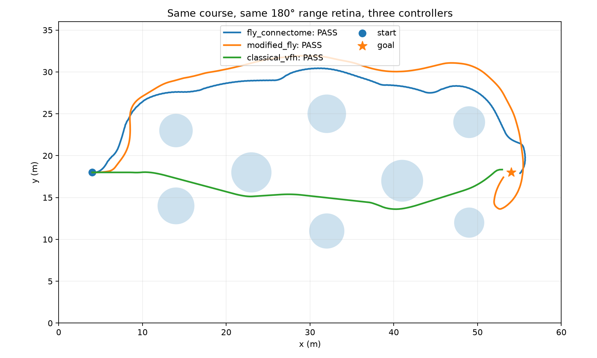
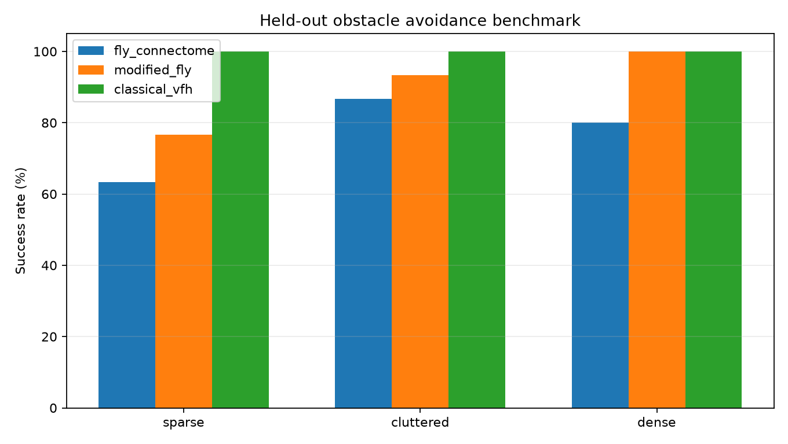
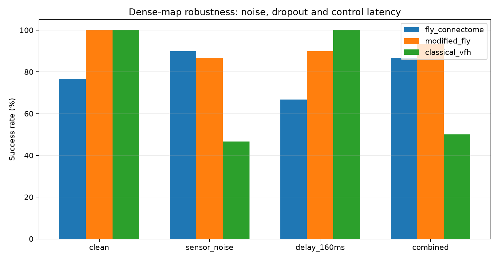
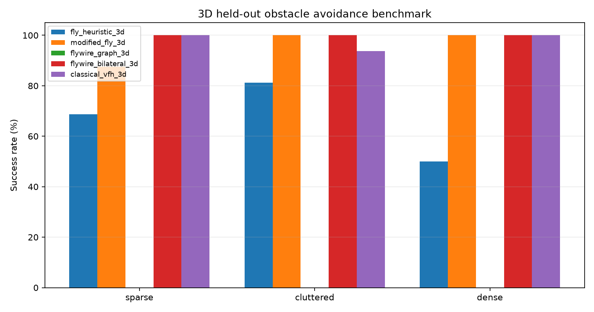
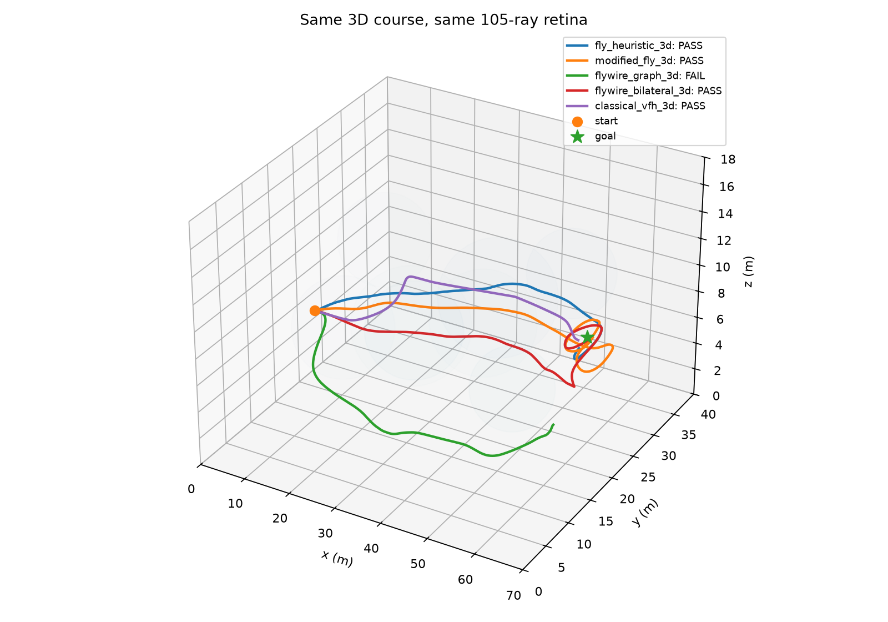
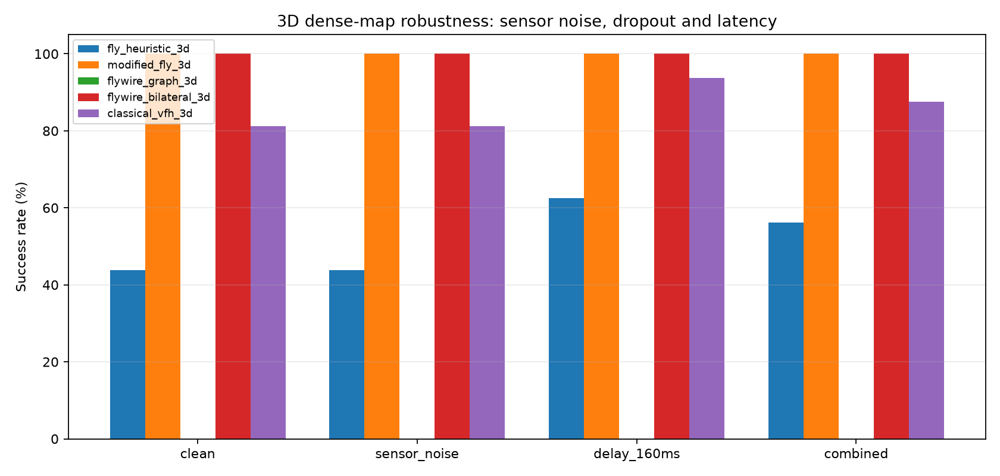

# FlyDrone Connectome Prototype

Bio-inspired UAV obstacle-avoidance research prototype comparing a fly-like looming reflex, a modified temporal-memory fly controller, and a classical VFH-style controller. The project has now begun replacing the hand-designed biological abstraction with a real FlyWire FAFB v783 subgraph.

## Current 2D results

Nominal held-out benchmark: 90 maps total (30 sparse, 30 cluttered, 30 dense). Overall success was ~76.7% for the fly-reflex controller, 90.0% for modified-fly, and 100% for classical VFH. In dense scenes modified-fly reached 30/30.

Robustness test (dense maps, 30 runs/profile): with range noise + 3% ray dropout, success was 90.0% fly-reflex, 86.7% modified-fly, 46.7% VFH. With noise/dropout + 160 ms control delay, success was 86.7%, 93.3%, and 50.0% respectively.

These are prototype simulation results, not evidence that a biological controller is generally superior. The noise result is hypothesis-generating and needs larger reruns and stronger baselines.

### Original Canavar figures

## Phase 2 — 3D

The new [`prototype/3d/`](prototype/3d/) benchmark uses 3D position/velocity, acceleration limits and a 105-ray retina (21 azimuth x 5 elevation). It is an inertial micro-UAV model, not yet full rigid-body motor/propeller physics.

First 3D held-out result (16 maps/difficulty): modified-fly scored 87.5/100/100%, raw FlyWire 0/0/0%, bilateralized FlyWire 100/100/100%, and classical VFH 100/93.8/100% on sparse/cluttered/dense maps. Raw and bilateralized FlyWire are kept separate because the FAFB DNp03 subgraph is strongly asymmetric.

## Phase 3 — 6-DoF rigid-body quadcopter

Phase 3 keeps the same 3D worlds and 105-ray body-mounted retina, but replaces the idealized velocity dynamics with a four-motor X-quad rigid-body model: gravity, roll/pitch/yaw attitude and body rates, inertia, thrust mixing, first-order motor lag, aerodynamic drag, motor saturation, and deterministic wind/gust profiles.

Nominal held-out result (12 maps/difficulty): heuristic fly 100/100/100%, modified-fly 100/100/91.7%, raw FlyWire 0/0/0%, bilateralized FlyWire 100/91.7/100%, and classical VFH 100/91.7/91.7% on sparse/cluttered/dense maps.

The dense stress suite adds sensor noise/dropout, 160 ms high-level command latency, gusty wind, and a combined condition. Modified-fly scored 100% in every Phase-3 stress profile; bilateralized FlyWire scored 100/100/100/70/90%, while classical VFH scored 100/90/100/70/60%.

These are still simulation results rather than PX4/Gazebo hardware-in-the-loop validation. The low-level attitude/velocity controller is shared across all high-level avoidance policies so the comparison isolates the avoidance layer as much as possible.

## Tests and reproducibility

The original Canavar source, raw episode table and figures now live in [`prototype/2d/`](prototype/2d/). The checked-in outputs were transferred directly from Canavar rather than reconstructed from summaries.

GitHub Actions runs four visible validation layers on every push/PR:

1. **Smoke tests** — deterministic world generation, retina/controller contracts, hover equilibrium, and known success cases.
2. **2D full benchmark + robustness** — reruns the original Canavar benchmark and uploads CSV/JSON/PNG/log artifacts.
3. **Phase-2 3D benchmark + robustness** — reruns the idealized 3D nominal and stress suites.
4. **Phase-3 6-DoF benchmark + robustness** — reruns motor/attitude rigid-body nominal and stress suites, including gusty wind.

Open the **Actions** tab or click the badge above to inspect each run.

## Real connectome extraction

The Zaku mirror contains a compact circuit extracted from FlyWire FAFB v783: 104 LC4, 210 LPLC2 and 2 DNp03 neurons. In this snapshot the extraction found 317 direct LC4/LPLC2-to-DNp03 synapses over 37 directed edges, plus 61 two-hop intermediates. The exported compact circuit contains 377 selected neurons and 1,117 selected edges.

See `out/fafb_loom_dnp03_circuit.json` and `out/fafb_loom_dnp03_report.json`.

## Repository map

- `prototype/2d/` — original Canavar simulation source, episode-level results and figures
- `prototype/3d/` — Phase 2 3D micro-UAV simulation, five controllers and 3D figures
- `tests/` — fast CI smoke tests
- `.github/workflows/tests.yml` — visible GitHub Actions benchmark pipeline
- `extract_fafb_circuit.py` — reproducible FAFB subgraph extraction
- `out/` — compact real-connectome circuit + report
- `reports/` — compact result summaries and figures
- `artifacts/` — portable research snapshot
- `data/README.md` — upstream dataset notes; raw FAFB downloads are intentionally excluded from Git

## Provenance

The original 2D benchmark was run on Canavar and has now been transferred intact into the repository. The real FAFB circuit extraction was performed on Zaku from the downloaded v783 tables. CI reruns the simulator independently on GitHub-hosted Ubuntu/Python 3.12 so results can be compared against the original Canavar run.
