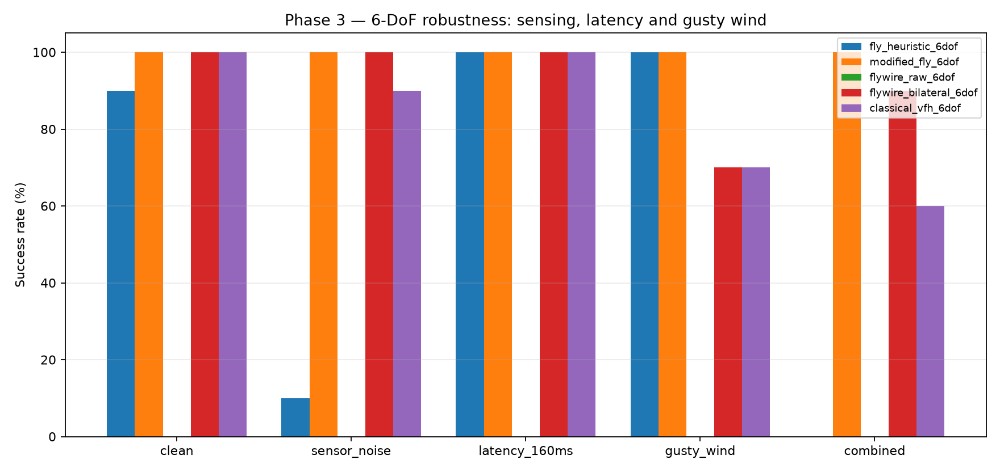
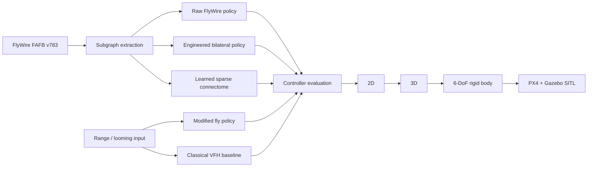
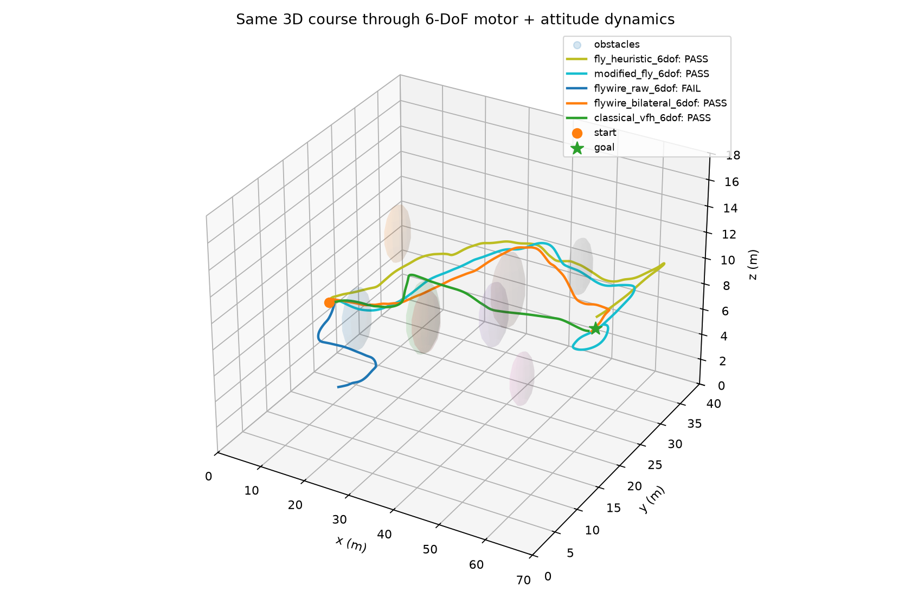
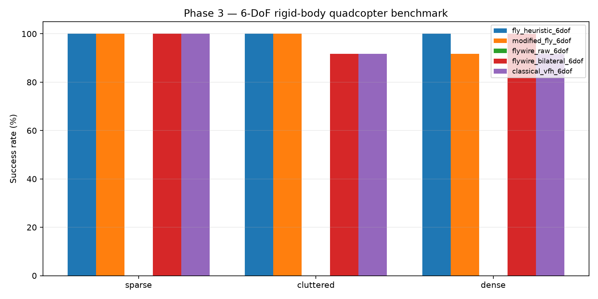

# FlyDrone

### Connectome-Inspired Reactive Obstacle Avoidance for Micro-UAVs

[](https://github.com/mstfcen/flydrone-connectome/actions/workflows/tests.yml)
[](https://github.com/mstfcen/flydrone-connectome/actions/workflows/phase4_px4.yml)
[](https://github.com/mstfcen/flydrone-connectome/actions/workflows/phase4_lidar.yml)

FlyDrone is a research prototype investigating whether compact **Drosophila-inspired visuomotor motifs**, informed by the FlyWire connectome, can provide robust reactive obstacle avoidance for micro-UAVs.

The project deliberately progresses through increasingly realistic validation layers: deterministic 2D arenas, idealized 3D motion, a four-motor 6-DoF rigid-body quadcopter, and finally an external **PX4 + Gazebo SITL** boundary.

> **Research question:** can a small temporal threat-estimation controller retain useful avoidance behavior when sensing is noisy, control is delayed, and the vehicle is disturbed by wind?



## Headline result

In the current 6-DoF dense-scene stress suite (10 held-out runs per profile), the modified fly-inspired controller retained 100% success across all tested perturbations.
| Stress profile | Modified fly | Bilateral FlyWire | Classical VFH |
|---|---:|---:|---:|
| Clean | **100%** | 100% | 100% |
| Sensor noise + dropout | **100%** | 100% | 90% |
| 160 ms command latency | **100%** | 100% | 100% |
| Gusty wind | **100%** | 70% | 70% |
| Combined | **100%** | 90% | 60% |

These results are **simulation evidence, not a claim of general biological superiority**. The sample sizes are intentionally modest, the environments are synthetic, and the bilateral FlyWire controller includes an explicit engineering intervention. See [Limitations](docs/LIMITATIONS.md).

## Learned sparse extension (v0.2)

A second experiment treats the 377-neuron FlyWire-derived graph as a fixed structural prior and learns edge gains, node dynamics and differentiable node gates from `modified_fly` imitation data.


On a 60-map selection set, an aggressive **24-neuron** mask matched the 377-neuron model's 83.3% success point estimate. After that size was frozen, a fresh 60-map confirmation set measured **85.0%** success for the 377-neuron model and **76.7%** for the fixed 24-neuron model. Post-hoc characterization placed a more conservative sparse regime around **32–40 active neurons**, which produced 85.0–86.7% on the same confirmation maps.

Five matched random 24-neuron masks averaged only **14.3%** success, indicating that the learned gate ranking carries task-relevant pruning information. This is a structured-pruning result, not a claim that a biological fly needs only 24 neurons for avoidance.

See the [v0.2 final report](docs/LEARNED_SPARSE_REPORT.md) and the [reproducible experiment directory](experiments/learned_sparse/README.md).

## What is connectome-derived?

A compact circuit is extracted reproducibly from **FlyWire FAFB v783** around looming-sensitive visual pathways and the DNp03 descending-neuron target:

- 104 LC4 neurons
- 210 LPLC2 neurons
- 2 DNp03 neurons
- 317 direct LC4/LPLC2 → DNp03 synapses across 37 directed edges
- 61 two-hop intermediate neurons
- 377 selected neurons and 1,117 selected edges in the exported circuit

The raw graph and the engineered bilateral variant are kept separate throughout the benchmark.
## System overview



The low-level vehicle dynamics are shared between policies so the staged comparisons isolate the avoidance layer as much as possible. Architecture details are documented in [docs/ARCHITECTURE.md](docs/ARCHITECTURE.md).

## Validation ladder

| Layer | Status | What is validated |
|---|---|---|
| 2D arena | ✅ | Held-out nominal + noise/latency benchmarks |
| Idealized 3D | ✅ | 105-ray body-mounted retina, 3D avoidance |
| 6-DoF quadcopter | ✅ | Four motors, attitude/rates, drag, motor lag, wind |
| PX4/Gazebo flight boundary | ✅ | Connect, arm, take off, telemetry, land |
| Gazebo `x500_lidar_2d` | ✅ | Live 1080-ray scan, ~270° FOV, 0.1–30 m |
| Runtime obstacle spawn | ✅ | Physical wall inserted into Gazebo world |
| MAVLink obstacle bridge | ⚠️ | No automatic `OBSTACLE_DISTANCE` stream observed |
| Learned connectome sparsification | ✅ | Fixed-topology training, hard pruning, random-mask and confirmation sets |
| Closed-loop PX4 avoidance | 🚧 | Experimental; current offboard integration is not validated |
## Controllers under test

**Modified fly** — a compact looming/proximity controller with time-to-collision estimation, temporal memory, braking and directional escape selection.

**Raw FlyWire** — a controller driven directly by the extracted FAFB connectivity. It is intentionally retained even though it fails the current 3D/6-DoF tasks; this is an important negative result.

**Bilateral FlyWire** — an explicit engineering variant that mirrors the well-connected hemisphere to provide a balanced left/right action pathway. It must not be interpreted as an untouched biological reconstruction.

**Classical VFH** — a vector-field-histogram-style reactive baseline optimized for goal alignment and obstacle clearance.

## Staged results

The progression matters more than any single percentage. A policy that looks strong in a simple geometric arena may fail after vehicle dynamics, latency or disturbances are introduced.





Detailed 2D, 3D and 6-DoF protocols and tables are in [docs/EXPERIMENTS.md](docs/EXPERIMENTS.md). Raw episode tables and JSON summaries remain committed alongside the benchmark code.
## Reproduce the simulation benchmarks

```bash
python -m venv .venv
source .venv/bin/activate
python -m pip install -r requirements.txt
pytest -q
python prototype/3d/benchmark6dof.py
python prototype/3d/stress6dof.py
```

GitHub Actions independently reruns the staged simulation suite on Ubuntu/Python 3.12. PX4/Gazebo boundary checks use the official `px4io/px4-sitl-gazebo` container.

## Repository layout

```text
extract_fafb_circuit.py   reproducible connectome subgraph extraction
out/                      compact extracted circuit + report
prototype/2d/             2D baseline and robustness experiments
prototype/3d/             3D + 6-DoF simulations and results
phase4/                   PX4/Gazebo SITL boundary experiments
experiments/learned_sparse/ v0.2 trainable/prunable connectome experiment
tests/                    deterministic regression/smoke tests
docs/                     architecture, experiments and limitations
.github/workflows/         reproducible CI and SITL diagnostics
```

## Documentation

- [Architecture](docs/ARCHITECTURE.md)
- [Experiment design and results](docs/EXPERIMENTS.md)
- [Limitations and open questions](docs/LIMITATIONS.md)
- [Learned sparse connectome — final report](docs/LEARNED_SPARSE_REPORT.md)
- [PX4/Gazebo integration status](phase4/README.md)

FlyDrone is intentionally scoped as a compact research prototype. The staged simulation/connectome study and the v0.2 sparsification extension are now frozen as reported baselines. Closed-loop PX4/Gazebo avoidance and real-vehicle testing are explicitly future work rather than claims of this release.