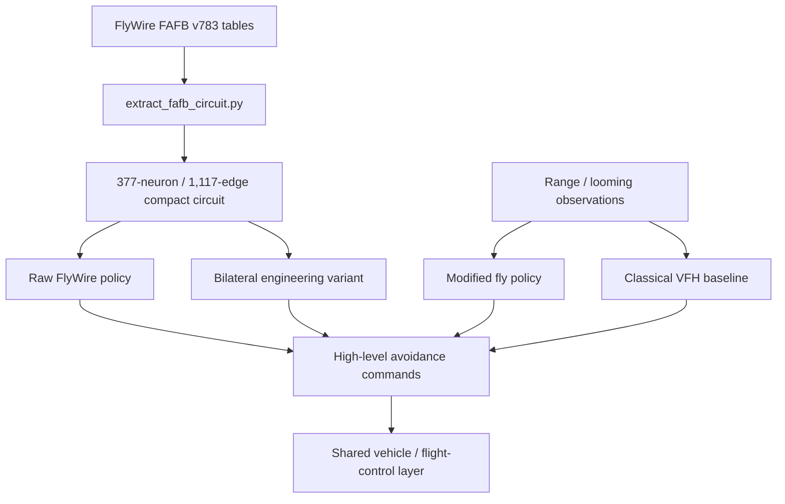

# Architecture

FlyDrone separates **perception**, **avoidance policy**, and **vehicle dynamics** so the same high-level idea can be tested across progressively harder environments.

## Data path

The raw and bilateral connectome policies are intentionally separate. The bilateral version is an engineering intervention introduced because the selected FAFB DNp03 subgraph is strongly asymmetric.

## Connectome extraction

The extractor selects LC4, LPLC2 and DNp03-related structure from FlyWire FAFB v783 and preserves directed connectivity, synapse counts, neuropil metadata and available neurotransmitter predictions.

The checked-in export is compact enough to inspect and reproduce without treating the complete fly brain as a flight controller.
## Avoidance policies

### Modified fly

The modified fly controller combines local closing-rate cues with proximity, an approximate time-to-collision risk, short temporal memory and a persistent escape direction. The design is inspired by fast insect visuomotor reflexes but is not claimed to be a neuron-by-neuron biological simulation.

### Raw FlyWire

The raw policy uses the extracted graph without compensating for its lateral imbalance. Its failure is retained as a negative result rather than tuned away.

### Bilateral FlyWire

The bilateral policy mirrors the better-connected side to create a balanced left/right action pathway while preserving the extracted topology and relative edge strengths within each side. It is explicitly labeled as engineered.

### Classical baseline

The VFH-style controller scores candidate directions using goal alignment, sensed clearance and smoothness, with a strong penalty for near-field obstacles.

## Validation layers

1. **2D** — planar geometry and a forward range retina.
2. **3D** — 3D position/velocity and a 105-ray body-mounted retina.
3. **6-DoF** — four-motor X-quad rigid-body dynamics, attitude/rates, gravity, drag, motor lag, saturation and wind.
4. **PX4/Gazebo SITL** — external flight stack and simulator boundary using the official PX4 Gazebo image.

The staged design is intentional: each layer introduces a new source of failure without changing the research question.
## Learned sparse extension

The v0.2 experiment adds a trainable controller whose **edge set remains fixed** to the extracted 377-node graph. Learnable parameters include edge gains, node leak/dynamics values, differentiable node gates and a small output layer.

The controller maps the 31-ray TTC/proximity representation onto LC4/LPLC2 input nodes, propagates activity through the fixed graph, and reads the well-connected left DNp03 as a threat output. The same parameters are evaluated a second time on mirrored sensory input to form a bilateral engineering signal.

Training proceeds in two stages: dense teacher imitation followed by increasing sparsity pressure with 5% node dropout. Hard top-k masks are then evaluated closed-loop rather than inferring utility from soft gate values alone.

This learned path is intentionally separate from the raw and bilateral hand-parameterized FlyWire policies; its results should be interpreted as task-conditioned compression of a connectome-derived prior.
