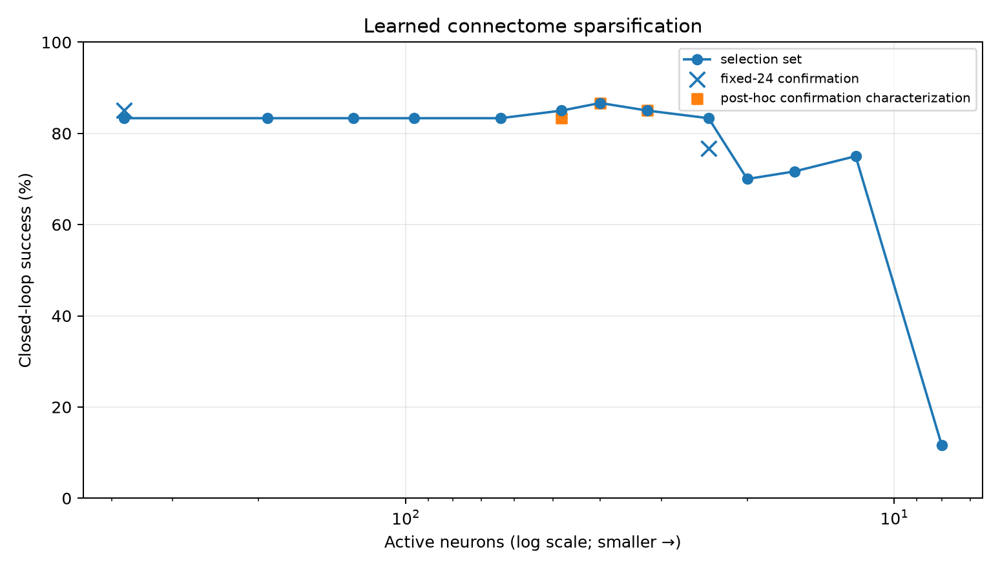
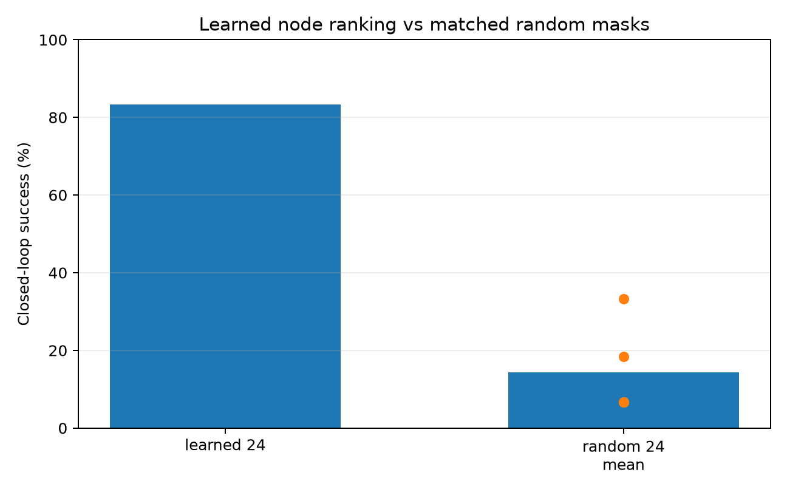

# Learned Sparse Connectome — v0.2 experiment

This experiment asks whether the 377-neuron FlyWire-derived avoidance circuit can be **trained and pruned** while preserving useful closed-loop behavior.

It is deliberately constrained: the model may tune edge gains, node dynamics and node gates, but it does not invent new graph edges. Because the extracted right DNp03 pathway has no selected incoming edges, the same learned hemisphere is evaluated on normal and mirrored sensory input to obtain a bilateral engineering controller.

## Result in one sentence

A gate-trained network can be compressed aggressively, but the independent validation shows a trade-off: a **24-neuron** circuit retained 76.7% success versus 85.0% for the 377-neuron model, while post-hoc characterization of **32–40 neurons** retained roughly the unpruned point estimate on the same confirmation set.



## Protocol

1. Extract the fixed 377-node / 1,117-edge LC4–LPLC2–DNp03 subgraph from FAFB v783.
2. Generate imitation data from the previously tuned `modified_fly` controller.
3. Train edge gains, node leak parameters and differentiable node gates with 5% node dropout.
4. Increase a sparsity penalty after dense imitation has converged.
5. Hard-prune by learned gate ranking and evaluate closed-loop navigation.
6. Compare against matched random masks and single-node ablations.
7. Freeze the aggressive 24-node choice and evaluate it on a new 60-map confirmation set.
## Selection-set pruning sweep

The 24-neuron point was selected on 60 held-out dense maps as the smallest tested network matching the unpruned success point estimate on that set.

| Active neurons | Success | Collision |
|---:|---:|---:|
| 377 | 83.3% | 15.0% |
| 48 | 85.0% | 13.3% |
| 40 | 86.7% | 8.3% |
| 32 | 85.0% | 15.0% |
| **24** | **83.3%** | 16.7% |
| 20 | 70.0% | 26.7% |
| 16 | 71.7% | 25.0% |
| 12 | 75.0% | 18.3% |
| 8 | 11.7% | 86.7% |

The full curve is stored in the evaluation artifacts. The sharp 8-neuron failure is evidence that the behavior is not preserved under arbitrary extreme pruning.

## Independent confirmation

After fixing `k=24`, a fresh set of 60 dense maps was evaluated.

| Policy | Active neurons | Success | Collision |
|---|---:|---:|---:|
| Modified-fly teacher | — | 93.3% | 6.7% |
| Learned unpruned | 377 | **85.0%** | 10.0% |
| Fixed learned sparse | 24 | **76.7%** | 21.7% |
For the independent set, the Wilson 95% intervals were 73.9–91.9% for the 377-node model and 64.6–85.6% for the fixed 24-node model. The point estimates therefore suggest a cost to the most aggressive pruning, but this small experiment is not powered to establish statistical equivalence or a precise effect size.

As an additional **post-hoc characterization** on that confirmation set, 48, 40 and 32 active neurons achieved 83.3%, 86.7% and 85.0% success respectively. These values are useful for locating a practical sparse regime, but they are not an independent confirmatory selection because those sizes were inspected after the confirmation set was opened.

## Matched random pruning

Five independently sampled 24-neuron masks were evaluated for 60 dense maps each without retraining the retained weights. Their success rates were:

`33.3%, 18.3%, 6.7%, 6.7%, 6.7%` — **14.3% mean**.

The learned 24-neuron mask therefore carries substantially more task information than same-size random masks under this protocol. This comparison tests the learned ranking, not random topologies retrained from scratch.



## Ablation signal

Single-node ablation of the 24-neuron exploratory circuit used a separate 16-map set. Three LC4 nodes produced the largest measured drop, from 75% baseline success to 50% when individually removed. Several additional LC4/LPLC4 nodes caused smaller losses.

DNp03 is a protected output node in the implementation and is **not** treated as a valid ablation result.
## Reproduce

From the repository root:

```bash
python -m venv .venv
source .venv/bin/activate
python -m pip install -r requirements.txt
python -m pip install -r experiments/learned_sparse/requirements.txt
python experiments/learned_sparse/make_dataset.py
python experiments/learned_sparse/train_prune.py
python experiments/learned_sparse/evaluate_sparse.py
```

`graph.json` and the trained `checkpoint.pt` are committed so evaluation does not require downloading the raw FAFB tables. Re-running `extract_graph.py` does require the FAFB v783 files described in `data/README.md`.

## Key artifacts

- `graph.json` — 377-node / 1,117-edge fixed topology.
- `checkpoint.pt` — trained sparse model checkpoint.
- `gate_ranking.csv` — learned node importance ordering.
- `training_summary.json` — dense imitation and sparsification history.
- `core_nodes24.csv` / `minimal_circuit24.json` — aggressive 24-node exploratory motif.
- `evaluation_summary.json` — consolidated selection, random-mask, ablation and confirmation protocol.
- `selected24_summary.json` — original 24-node selection-set summary.
- `confirmatory60_summary.json` — independent fixed-24 confirmation.
- `confirmatory_extra.json` — post-hoc 32/40/48 characterization.
- `ablation24.csv` — single-node ablation observations.

The broader interpretation and limitations are summarized in `docs/LEARNED_SPARSE_REPORT.md`.
